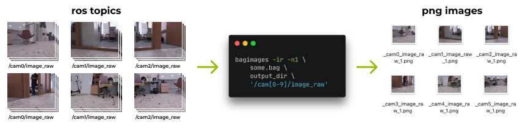

#  bagimages 🤖 👜 🖼️ export images from rosbag files

 


A multi-platform and dependency-free tool for exporting images from rosbag files.

<br/>

## Features

- Export from topics by name and by regular expressions.
- Export at the specified time intervals from the beginning of the bag file.
- Export the specified number of frames with a certain step.

## How to install?

> Installation via package managers will be available later.

### Installation on Ubuntu / MacOS

Just run on terminal:

```bash
curl -o- https://raw.githubusercontent.com/tonykolomeytsev/bagimages/master/install.sh | bash
```

Or download suitable executable from the [latest release](https://github.com/tonykolomeytsev/bagimages/releases/latest).

### Installation on Windows

Download and run suitable executable from the [latest release](https://github.com/tonykolomeytsev/bagimages/releases/latest).

### Build source code

Install Rust: https://www.rust-lang.org/tools/install

And then clone and build the project with `cargo`:

```bash
git clone https://github.com/tonykolomeytsev/bagimages.git
cd bagimages
cargo build --release
```

And then take the compiled app: `{project_root}/target/release/bagimages`

## How to use?

**NOTE:** Sometimes when exporting images via cv_bridge, there is confusion with color channels: rgb8 images turn into bgr8. To compensate for this effect, use the `-i` option. 

#### Export all frames from specified topic to the current directory

```bash
bagimages some.bag . /some_topic/raw_image
```

#### Export all frames from specified topic to the `./exported` directory

```bash
bagimages some.bag exported /some_topic/raw_image
```

#### Export one first frame

```bash
bagimages -n1 some.bag . /some_topic/raw_image
# or
bagimages --number 1 some.bag . /some_topic/raw_image
```

#### Export one first frame from different topics

```bash
bagimages -n1 some.bag . /topic1 /topic2 /topic3
# or
bagimages --number 1 some.bag . /topic1 /topic2 /topic3
```

#### Export one first frame from different topics (with regular expression)

**NOTE:** It is better to write regular expressions in quotes.

```bash
bagimages -r -n1 some.bag . '/topic\d'
# or
bagimages --regex --number 1 some.bag . '/topic[0-9]'
```

#### Export 5 frames with 10 frames step

It means frames number 1, 11, 21, 31, 41 will be exported.

```bash
bagimages -n5 -S10 some.bag . /some_topic/raw_image
#              ^
#              It's a capital S
# or
bagimages --number 5 --step 10 some.bag . /some_topic/raw_image
```

#### Export every 5-th frame from 3-rd to 10-th second

```bash
bagimages -S5 -s3 -e10 some.bag . /some_topic/raw_image
# or
bagimages --step 5 --start 2 --end 10 some.bag . /some_topic/raw_image
```

#### Export of one frame at the tenth second

```bash
bagimages -n1 -s10 some.bag . /some_topic/raw_image
# or
bagimages --number 1 --start 10 some.bag . /some_topic/raw_image
```

#### Export with conversion from BGR8 to RGB8 (or vice versa)

```bash
bagimages -i [OTHER_OPTIONS] some.bag . /some_topic
```

## Limitations

Currently only `RGB8` and `BGR8` images are supported.

## Project status

The project is in progress and is being developed just for fun. Additional features will be added in the future.
